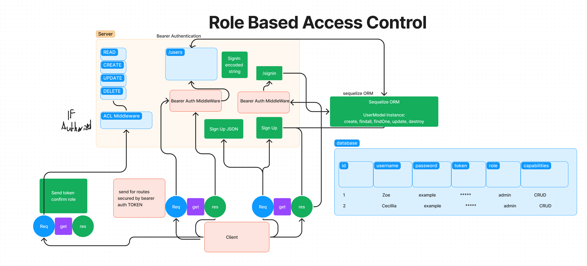

# RBACs, v1 and v2.

Project: Auth API Server Combination

Author: Zoe Gonzalez

Problem Domain: 

This application creates an api and it also has an additional layer of security meant to act as an authentication layer. This authentication layer requests the user to input a password and asks the user for a jwt and a secret if both the role and authenication are validated then the user will be granted access. 

GitHub Actions:https://github.com/ZuSolaris/auth-api/actions

Production Deployment: https://dashboard.render.com/web/srv-cej3n6kgqg4ekmbu7p00/deploys/dep-cej3n74gqg4ekmbu7r00

Setup
env requirements
see .env.sample

PORT: 3001

How to initalize application
'npm start'

'nodemon'

'npm test'

How to use your library
-nodemon for starting

-npm test for testing

## Routes

### The routes also have an additional layer of security. 

/:model Get All

/:model/:id Get One

/:model Create

/:model/:id handleUpdate

/:model/:id handleDelete

